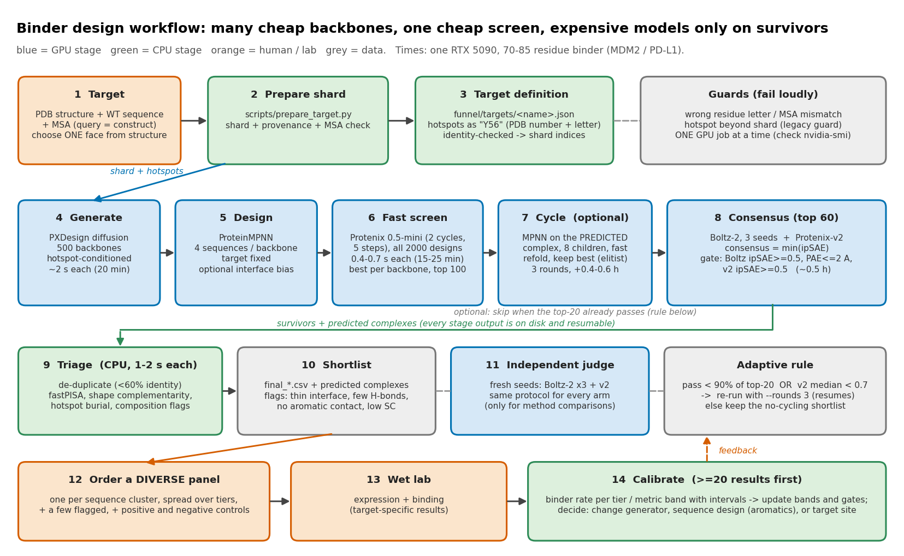

# BinderFunnel (working name): a protein-binder design workflow built on PXDesign

> **Working name.** Rename freely (search for `BinderFunnel`; `pyproject.toml` says `binderfunnel`).
> **This is not PXDesign.** It reuses PXDesign's diffusion model and vendored code (Apache-2.0, ByteDance) as the backbone generator, and adds everything around it:
> a staged funnel, an independent two-model judge, interface quality metrics, review packages and operating guidance. It is not affiliated with or endorsed by ByteDance.

Many cheap backbones → one cheap screen → expensive models only on the survivors → a review folder with ranked models, plots and statistics.



*(editable Mermaid version and per-stage file flow: [docs/WORKFLOW.md](docs/WORKFLOW.md))*

## What it does

1. **Target definition** with hotspots written as `"Y56"` (PDB number + residue letter); residue identity is checked, so the silent wrong-site failure of the stock pipeline cannot happen.
2. **Generate** hundreds of hotspot-conditioned backbones (PXDesign diffusion, ~2 s each), **design** sequences (ProteinMPNN, optional interface-only aromatic bias).
3. **Screen** every design with Protenix-0.5-mini (0.4-0.7 s), optionally **cycle** (redesign on the predicted complex, refold, keep the best).
4. **Judge** the survivors with Boltz-2 (3 seeds) and Protenix-v2 independently; a design passes only if both agree.
5. **Triage** with fastPISA and an in-house shape-complementarity implementation (flags, not scores), de-duplicate, tier.
6. **Review package** `final_design/` per run: best models (CIF/PDB), FASTA, tables, plots, PyMOL/ChimeraX scripts, a report with all statistics.

## Results so far (computational only; nothing is wet-lab validated)

Top-20 designs per strategy, judged identically with fresh seeds (Boltz-2 x3 + Protenix-v2). *Pass* = Boltz ipSAE >= 0.5 and interface PAE <= 2 A and v2 ipSAE >= 0.5. GPU = RTX 5090.

| target | stock pipeline, 8 backbones | stock pipeline, 100 backbones | **funnel, no cycling** | **funnel, 3 cycles** |
|---|---|---|---|---|
| MDM2 (p53 pocket) | 5 / 8 | 20 / 20 (1.20 h) | **20 / 20 (0.71 h)** | 20 / 20 (1.09 h) |
| PD-L1 (PD-1 face) | 2 / 8 | 16 / 20 (1.63 h) | **20 / 20 (1.24 h)** | 20 / 20 (1.81 h) |
| FimA (donor-strand groove, new target) | 0 / 8 | 9 / 20 (1.12 h) | 16 / 20 (0.86 h) | **20 / 20 (1.30 h)** |

- The biggest single factor was **conditioning on the right residues** (the stock pipeline reads hotspots on a prebuilt shard in shard numbering; wrong indices ran silently).
- Cycling helps on harder targets (FimA) and is optional elsewhere; an adaptive rule is in the review report.
- **What a pass means:** two structure predictors agree. On 206 wet-lab-labelled designs (4 targets) they separated binders from non-binders only moderately: pooled AUROC 0.67-0.75, but that pools across targets and so partly credits target difficulty. Within a target and method it ranges 0.36-0.93 (`bench/results/analysis.txt`: Boltz ipSAE-min 0.36 on IL-7R/RFdiffusion, 0.42 on PD-L1/BoltzGen, 0.93 on MDM2/EvoDiff), and on the 1,320-design release it is about 0.70 within target. Most of a campaign's hit rate is decided by which target was chosen. Treat the output as a candidate list, order a diverse panel, and calibrate with lab results.
- Details: [docs/REPORT.md](docs/REPORT.md) (benchmark, diagnosis, follow-up checks), [docs/RECOMMENDATIONS.md](docs/RECOMMENDATIONS.md) (how to run it well).

### Hard test: FimH mannose pocket (E. coli adhesin, PDB 3MCY; not tuned on)

Top 20 per route, judged together with fresh seeds; controls = 3 unrelated decoy targets + 2 sequence shuffles per design. Full pre-registered criteria and results: [docs/OVERNIGHT_RESULTS.md](docs/OVERNIGHT_RESULTS.md).

| route | pass both models | pass AND in the mannose site | margin >= 0.3 over controls | quality-flagged |
|---|---|---|---|---|
| funnel, no cycling | 13/20 | 9 | not run | 35% |
| **funnel, 3 cycles** | **20/20** | **14** | **90%** | 30% |
| funnel + interface aromatic bias | 13/20 | 12 | not run | 25% |
| dock a known scaffold + redesign interface (LightDock) | 1/20 | 0 | 0% | 85% |

Recommended cost-efficient recipe (when to stop, when to add cycling, controls, ordering): [docs/PROTOCOL.md](docs/PROTOCOL.md). No site given? [docs/HOTSPOTS.md](docs/HOTSPOTS.md).

## Quick start

```bash
./scripts/setup.sh                              # builds .pxd/envs/{pxd,boltz} (or symlink existing envs)
python3 scripts/pxd_env.py                      # what this machine can run
# 1. build the target shard + MSA (see scripts/prepare_target.py --help), then write funnel/targets/<name>.json
# 2. smoke test (~10 min), then the real run (~0.7-1.2 GPU-h for a 70-85 aa binder)
.pxd/envs/pxd/bin/python funnel/run_funnel.py --target <name> --out out/funnel/<name> --n-backbones 500 --rounds 0
# 3. review:   out/funnel/<name>/final_design/README.md   (models, plots, stats)
# 4. if the review's adaptive rule says so: rerun the same --out with --rounds 3 (stages 1-3 are reused)
```

One GPU job at a time. Worked target definitions: `funnel/targets/{pdl1,mdm2,fima}.json`. Full operating guide: [docs/RECOMMENDATIONS.md](docs/RECOMMENDATIONS.md).
**AI agents operating this repo: read [AGENTS.md](AGENTS.md) first.**

## Resume, extend, multi-GPU

- **Nothing is lost to a crash.** Generation runs in chunks, design + screening per chunk, cycling per round, and every Boltz/Protenix prediction is cached; all tables are written atomically.
  Re-run the same command to continue. `python funnel/run_funnel.py --out <run> --status` shows what is done.
- **Continue / optimise from last:** raise `--n-backbones` (only the new chunks are generated and screened), `--rounds` (cycling continues from the saved round) or `--final-m`
  (only new candidates get the expensive models). A resume with different guarded settings (target, hotspots, chunk size, MPNN settings...) is refused unless `--allow-config-change`.
- **Several GPUs:** `--gpus 0,1,2,3` (or `GPUS=0,1,2,3 funnel/run_overnight.sh`): chunks and screening units run in parallel, cycling refolds are sharded, the three Boltz seeds run on separate GPUs
  and Protenix-v2 on another (designs are never split inside a Boltz batch).

## Judge regimes

`--judge legacy` (default) is the published consensus: Boltz-2 x3 seeds + Protenix-v2. `--judge new` uses one Boltz-2 seed + one AlphaFold3 seed and orders the shortlist by the mean of the two ipSAE values; `--fork-from` runs it on exactly the candidates of a finished legacy run. What the wet-lab-labelled release data does and does not show, the AlphaFold3 setup and the fair-comparison protocol: [docs/JUDGE_REGIME.md](docs/JUDGE_REGIME.md).

## Design routes

| route | command | status |
|---|---|---|
| **Funnel** (PXDesign diffusion + MPNN, fast screen, cycling, consensus) | `funnel/run_funnel.py --target T --out O` | default; results above |
| **Dock a known scaffold, redesign only the interface** (LightDock, restrained to the hotspots) | `funnel/dock_redesign.py --target T --out O --scaffolds all` | experimental; early tests gave ipSAE ~ 0 (see docs/OVERNIGHT_PLAN.md) |
| **Bring your own designs** (any generator) | `funnel/run_funnel.py ... --designs-csv designs.csv` | supported; see [docs/EXTENDING.md](docs/EXTENDING.md) |
| Interface aromatic bias in MPNN | `--mpnn-bias iface:0.6` | optional; neutral to slightly positive, no controls yet |
| **No site given:** surface screen / blind-docking consensus | `funnel/hotspots.py`, `funnel/dock_epitope.py` | shortlist generators (surface screen validated on 4 known sites; docking consensus experimental), see docs/HOTSPOTS.md |

Validation tools: `funnel/judge.py` (identical-protocol comparison of arms), `funnel/controls.py` (decoy targets + sequence shuffles), `funnel/screen_calibration.py`, `bench/` (ProteinBase wet-lab benchmark).
Example: `funnel/targets/fimh.json` defines the E. coli FimH mannose pocket from PDB 3MCY; `fetch_target.py` builds it with a ligand-site probe so designs can be tested for occupying the site.

## Install on a new machine

```bash
git clone <this repo> && cd <repo>
./scripts/setup.sh            # the two core environments (pxd, boltz); needs python 3.10-3.13, a CUDA GPU, internet
./scripts/setup_extras.sh     # plotting libs, fastPISA, LightDock (own venv), the fused LayerNorm kernel (needs nvcc)
./scripts/fetch_checkpoints.sh   # prints where to obtain the PXDesign / Protenix weights (not redistributed) and verifies them
python funnel/fetch_target.py funnel/targets/pdl1.json      # builds a target from its public PDB id (structures are never shipped)
PYTHONPATH=$(pwd) .pxd/envs/pxd/bin/python -m pytest tests -q    # data-dependent tests skip with an instruction
```

## The review package (`<run>/final_design/`)

`README.md` (report) · `designs.csv` · `evaluated_all.csv` · `sequences.fasta` · `models/` (Boltz-2 and Protenix-v2 complexes) · `plots/` (funnel yield, score scatter, per-design heatmap,
hotspot burial, composition vs wet-lab binders, diversity, seed stability, cycling) · `view_pymol.pml` · `view_chimerax.cxc` · `stats.json`

## Layout

```
funnel/       the workflow: run_funnel, judge, final_design, sc (shape complementarity), pisa (fastPISA wrapper), common, targets/
pxdesign/     vendored + patched PXDesign: diffusion backbone generator (and the original pipeline)
pxdbench/     vendored + patched PXDesign benchmark code: metrics, Boltz backend, target preparation
colabdesign/  vendored ColabDesign build whose ProteinMPNN accepts `weights=`
scripts/      environment setup (+ extras), target preparation, the original campaign runner, export_public.py / check_public.py (clean release tree + scanner)
bench/        ProteinBase benchmark + generation experiments (scores, AUROC tables, figures)
docs/         REPORT, RECOMMENDATIONS, WORKFLOW, EXTENDING, OVERNIGHT_PLAN, pipeline-flow
tests/        CPU only, no GPU needed:   PYTHONPATH=$(pwd) .pxd/envs/pxd/bin/python -m pytest tests -q   (682 pass, 21 skipped in the full env; in a bare pandas/numpy/scipy env the tests that need torch, protenix, jax, biotite or matplotlib are skipped, not errors)
.archive/     (git-ignored) earlier experiments and documents; nothing was deleted
```

## Known limitations and roadmap

- Computational predictions only; no wet-lab validation yet (lab feedback loop planned, see RECOMMENDATIONS section 14).
- Designs are helical bundles that are Lys/Glu-rich and aromatic-poor (cause traced to ProteinMPNN's prior; interface-bias and hallucination/co-design options under test).
- Fast screen (Protenix-0.5-mini) is a 3-4x enricher, not a filter: keep the top 20%.
- Early negative result: docking known scaffolds and redesigning their interface gave ipSAE ~ 0 in a small smoke test; the full run is part of the overnight plan.
- Not yet supported: cyclic peptides (plan: Boltz-2 `cyclic` scoring + AF2 cyclic judge + a peptide generator; RECOMMENDATIONS section 15), antibodies, small-molecule targets.

## Licence and attribution

This repository is **AGPL-3.0-or-later** (`LICENSE`; commercial terms in `COMMERCIAL.md`). Vendored code keeps its own licences (`THIRD_PARTY.md`): PXDesign and its benchmark code (ByteDance, Apache-2.0),
ColabDesign (Apache-2.0), and files adapted from BindCraft (MIT). It calls Boltz-2, Protenix, ProteinMPNN and fastPISA (github.com/dzyla/fastPISA) as separate tools under their own licences, and uses public ProteinBase data
(Adaptyv) for benchmarking. If you use this work, please cite PXDesign, Boltz-2, Protenix, ProteinMPNN and ProteinBase as appropriate.
