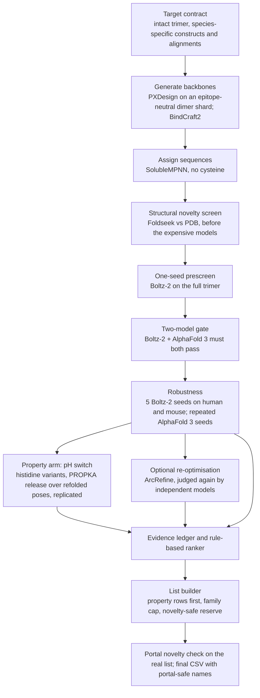

# Design flow for the Adaptyv x Anthropic competition (Challenge 2: conditional TNF-α binder)

This is the flow we ran, written without any design sequences, design identifiers or per-design scores. Everything is computational: **no design from this flow has been tested in the laboratory**, and every score is a model prediction of interface confidence or of a protonation energy, not an affinity or a measured switch. Thresholds are priors from one target; re-derive them for a new target (see `CAMPAIGN_PLAYBOOK.md`).

## The task
A binder to the human TNF-α homotrimer that binds at pH 7.4 and does not bind at pH 6.0, is cross-reactive with mouse TNF-α (measured at pH 7.4), and has useful affinity. The ranking order on the competition page is pH-selective binding, then mouse cross-reactivity, then affinity. Track 1 means 20–40 sequences are submitted and the first 20 *that pass the portal's filters* are screened in the submitted order. Sequences are 10–250 amino acids, canonical residues, one CSV (`name,sequence,molecule_class`). Designs must be de novo and structurally novel.

## The flow

## Stages, gates and what each cost us
| stage | tool | gate | notes from our run |
|---|---|---|---|
| target contract | organiser PDB and alignments, own checks | residue counts, numbering maps and hotspot identity asserted in code | mouse numbering shifts by one above residue 72; one construct/structure residue discrepancy; a NUL byte in an alignment made Boltz-2 skip the input and still exit 0 |
| generation | PXDesign (coordinates only), BindCraft2 | none | diffusion is cheap (seconds per backbone); scoring is the cost |
| sequences | SolubleMPNN | no cysteine | never plain ProteinMPNN (4.8% vs 27.9% hit rate in the public Anthropic release) |
| novelty | Foldseek TM-align against the PDB | strict hit: TM ≥ 0.8 over ≥ 70% of the chain | run first; short helical designs mostly failed; clean fraction rose from ~21% at 62–112 aa to ~98% at 180–200 aa |
| prescreen | Boltz-2, one seed | ipSAE ≥ 0.35–0.5 | ~4–5% of ~1,200 long designs passed |
| gate | Boltz-2 + AlphaFold 3 | both ≥ 0.5 | about a third of the prescreen survivors passed both; two *different* models, not seeds of one |
| robustness | 5 Boltz-2 seeds, both species; AF3 seeds | human mean ≥ 0.65 and worst seed ≥ 0.5; mouse mean and worst ≥ 0.5 | single-seed rank barely predicted who survived; a design can pass mouse at 3 seeds and fail at 5 |
| pH arm | PROPKA on refolded poses | ≥ 5 poses, paired with the parent, release ≥ 0.5 kcal/mol with delta − 2·SE > 0 | replicate in independently composed batches; report the worst pose |
| re-optimisation | ArcRefine (Mosaic, Boltz-2) | must pass the independent judges | a minority of runs kept binding; the AlphaFold 3 comparison with the parent is the one that counts |
| ranking | ledger + `phbind/ranking.py` | tiers A–D and X | more seeds beat fewer, then newest; clean novelty ahead of thin; 40% family cap |

## Scoring in one paragraph
Binding is ipSAE computed from the predicted aligned error between the binder and **all three target copies treated as one group**, taking the **minimum** of the two directions (the maximum reads 0.17–0.20 higher and would admit designs the thresholds were never fitted for). Global ipTM and interface descriptors (buried area, contacts, hydrogen bonds) are not used for ranking. Every Boltz-2 batch carries a failing and a passing control; Boltz-2 output depends on batch composition and command-line flags, so designs are compared only inside one batch with the parent present, and an identical rerun is not a replicate.

## Cross-species
Species is a parameter of the Boltz-2 run and selects the construct, the species-specific alignment and the expected residue count together (and asserts them). Mouse has its own numbering map. A design that passes human is not assumed to pass mouse; mouse is scored at 5 seeds with the same worst-seed rule. AlphaFold 3 was not run on mouse (it should be).

## The pH arm
Histidines (at most three) were placed on validated binders near target cations, so that protonation at pH 6.0 weakens binding. Release was scored as a PROPKA binding-energy difference between pH 6.0 and 7.4 in the same pose for parent and variant. Lessons: one pose varies by ~0.9 kcal/mol; the first batch overstated the effect for every strong row; parents with a baseline below −1.2 kcal/mol cannot be rescued by one or two histidines; a second lens (published geometric rules for acid-off binders, Ahn et al., bioRxiv 2025.09.29.678932) agreed with PROPKA only weakly (Spearman +0.19 over 19 variants), so a pH row was called strong only where both agreed. Buried histidine–cation networks in the binder core (the route that produced the published TNF-α hits) were not built.

## Selecting and ordering the list
Property (pH) rows first, then dual-species binders; at most three rows per backbone family in the first 20 and 40% overall; the rows after 20 are a reserve ordered novelty-safe first, because a row rejected by the portal's novelty filter is replaced by the next one. **Run the portal's novelty check on the real list the day before the deadline.** In our case the portal scored two of the first 20 rows at level 2 although our whole-chain proxy showed no strict hit: the portal predicts a structure, splits it into domains and matches each domain, so a proxy should do the same (structure prediction, domain segmentation, Foldseek per domain, coverage-weighted levels).

## Guards that caught real errors
Assert target residue counts in every driver; identify the binder chain by sequence, not chain letter; count output artefacts (a confidence file per design), not exit codes; end setup jobs with an import test; verify CUDA with a real matmul; keep carriers in every batch; read sequences from the ledger, never retype them; write the final CSV with portal-safe names and a name map.

## What did not help
Histidine-biased backbone generation; a protonation-aware design model used as a generator; ESM-based stability and likelihood scores (no gain over Boltz-2 on the public Anthropic release); changing the hotspot string; re-optimising against Boltz-2 and trusting Boltz-2 to judge the result.

## Tools
PXDesign, BindCraft2, SolubleMPNN (ProteinMPNN repository), Boltz-2, AlphaFold 3, Foldseek, PROPKA 3, ArcRefine and Mosaic, Proton-PottsMPNN. Code for scoring, the ledger, the ranker and the list builder: `phbind/` in this repository. AlphaFold 3 weights are licence-restricted and are not distributed here.
