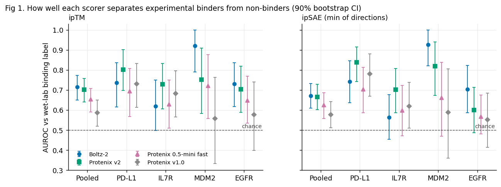
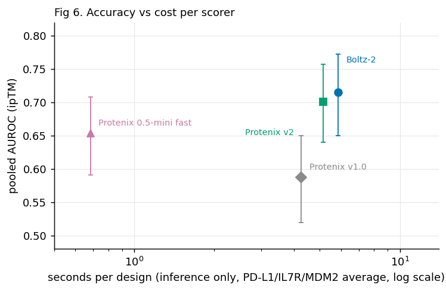
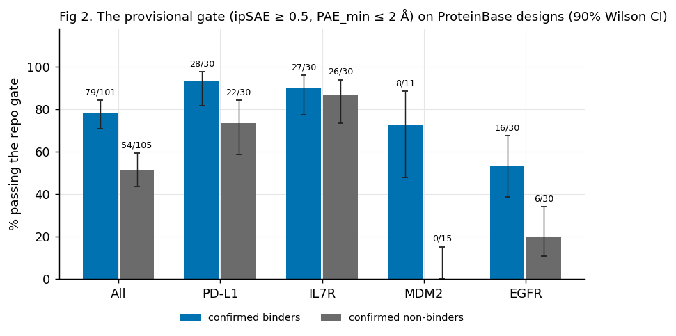
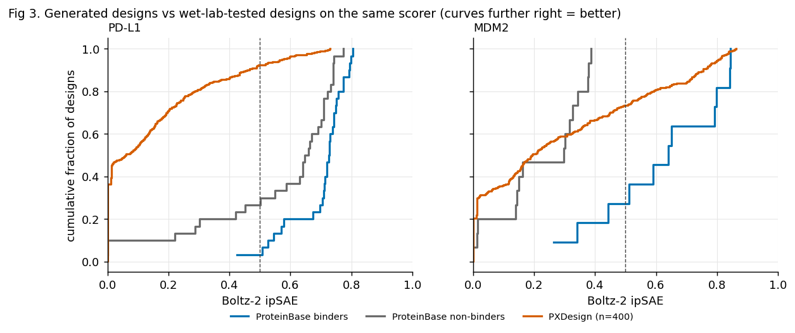
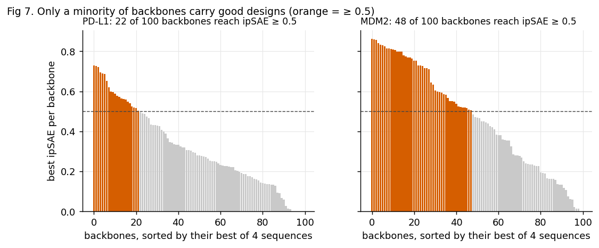
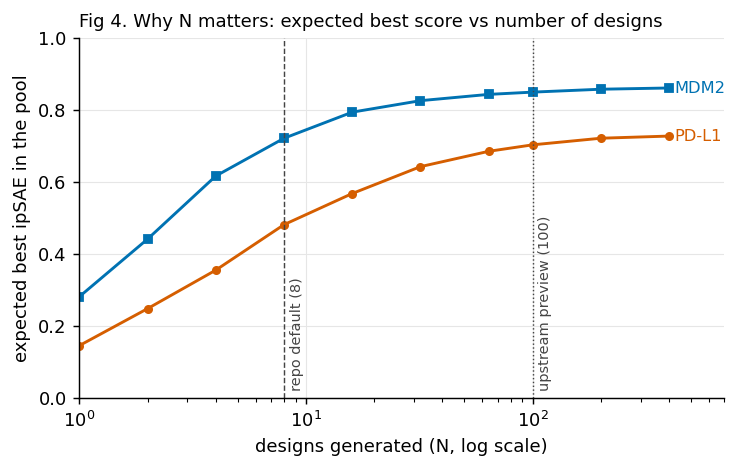
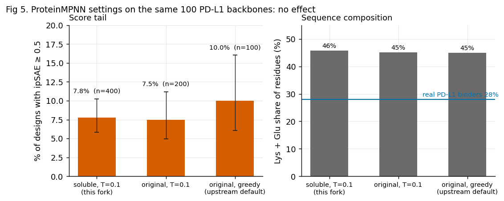
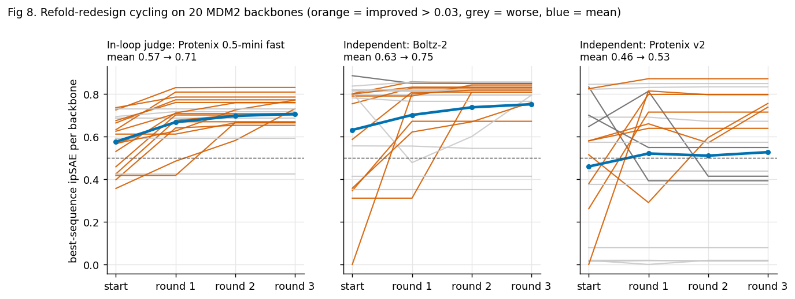

# PXDesign + Boltz-2 binder design: evaluation, diagnosis and cleanup

**Date:** 2026-10-04 · **Machine:** 1× RTX 5090 (32 GB) · **Data:** ProteinBase bulk export of 2026-01-28
**Code and raw numbers:** `bench/` (scripts), `bench/results/` (tracked outputs, figures, `stats.json`)

---

## 1. Executive summary

**Why the designs score low.** Mostly because the pipeline is run at about one-twelfth of the scale it needs, and partly because the
selection gate and the scorer are weak on some targets. It is *not* because of the ProteinMPNN settings, which I suspected and tested.

| # | Finding | Evidence | Confidence |
|---|---|---|---|
| 1 | **The default run is far too small.** The wrapper makes 8 backbones; upstream's smallest preset is 100. | Expected best ipSAE in a pool: 0.48 at N=8 vs 0.70 at N=100 (PD-L1); 0.72 vs 0.85 (MDM2). Fig 4. | High |
| 2 | **Hit rate depends heavily on the target.** At N=100 × 4 sequences, 26.5% of MDM2 designs pass the gate vs 7.0% on PD-L1. | 106/400 vs 28/400. Fig 3, 7. | High (two targets) |
| 3 | **The repo's gate is only informative on some targets.** It passes 51% of confirmed non-binders overall; 0% on MDM2, 73% on PD-L1, 87% on IL7R. | 206 labelled designs. Fig 2. | Medium (small n, selection bias; §4.3) |
| 4 | **ProteinMPNN weights/temperature are not the cause.** Three settings give the same score tail and the same charge-heavy sequences. | 100 PD-L1 backbones, 700 sequences. Fig 5. | High |
| 5 | **Boltz-2 and Protenix v2 are equally good (and only moderately good) judges.** Pooled AUROC 0.71 vs 0.70. Protenix 0.5-mini is 8× faster at 0.65. | 206 designs, wet-lab labels. Fig 1, 6. | Medium |
| 6 | **Checkpoint names on this machine are wrong.** The file called `…v0.5.0.pt` is the v2 weights (or v1.0.0 in another checkpoint folder). | sha1 comparison. | High |
| 7 | **`run_campaign.sh` reported success when every fold had failed.** Fixed. | Reproduced and verified. | High |

**Are there good hits?** On **MDM2**, yes by computational criteria: 77 designs from 31 of 100 backbones have ipSAE ≥ 0.6 and interface PAE ≤ 2 Å,
the best at ipSAE 0.86 / ipTM 0.95, in a regime where no tested non-binder passed the gate. On **PD-L1** there are a few
(best ipSAE 0.73) but the gate does not discriminate there, so they are weaker candidates. **Nothing here is wet-lab validated, and
ProteinBase holds 31 PXDesign submissions (Nipah G); the 6 with a wet-lab binding label were all negative (an earlier version of this report said "0 of 36", which counted replicate records).** Treat the list as an experiment to order, not as binders.

---

## 2. What was done

1. **Scorer benchmark (Phase 1).** 206 ProteinBase designs with experimental binding labels (4 targets) folded with their targets by
   four scorers; AUROC against the label.
2. **Generation experiments (Phase 2).** Ran the pipeline as shipped on two ProteinBase targets (PD-L1, MDM2) at N=8 and N=100, re-folded
   every design with the Phase 1 scorer, and compared against the labelled designs on the same scale. Tested ProteinMPNN settings on identical
   backbones.
3. **Cleanup (Phase 3).** Moved everything non-core to a git-ignored archive, fixed the defects found, kept the test suite green.

### 2.1 Benchmark design

| Target | PDB used for generation | Construct scored | Labelled designs (binders / non-binders) | Methods in the labelled set |
|---|---|---|---|---|
| PD-L1 | 3BIK chain A (18–229) | UniProt Q9NZQ7 19–238 | 60 (30 / 30) | BoltzGen 27, DSM-SynTeract 17, mosaic 16 |
| IL7R | – | P16871 21–239 | 60 (30 / 30) | BoltzGen 24, RFdiffusion 27, mosaic 9 |
| MDM2 | 1YCR chain A (25–109) | Q00987 17–125 | 26 (11 / 15) | EvoDiff 26 |
| EGFR | – (existing repo target) | P00533 25–645 | 60 (30 / 30) | protRL 12, BindCraft 5, RFdiffusion 4, ESM2 3, **36 with no method recorded** (553 of 826 EGFR entries lack one) |

Selection: designs 40–200 aa, standard residues, label-balanced random sample (seed 0). A design counts as a binder if any experimental
`binding` evaluation in ProteinBase is True (13 of 2,630 target-design pairs had conflicting replicates and are labelled positive).

Scorers (`bench/score_*.py`, all one sample, binder single-sequence, target MSA from the ColabFold server, **one shared ipSAE
implementation** in `bench/metrics.py` so arms differ only in the model):

| Arm | Model | Settings |
|---|---|---|
| Boltz-2 | `boltz2_conf` | 3 recycles, 200 steps |
| Protenix v2 | `protenix-v2` | 4 cycles, 200 steps |
| Protenix v1.0 | `protenix_base_default_v1.0.0` | 4 cycles, 200 steps (**this is the file mislabelled "0.5"**) |
| Protenix 0.5-mini "fast" | `protenix_mini_default_v0.5.0` | 2 cycles, 5 steps |

---

## 3. Results

### 3.1 How well do the scorers predict experiment? (Fig 1, Fig 6)



AUROC vs wet-lab binding label, ipTM (90% bootstrap CI for the pooled column). 0.5 is chance.

| Scorer | Pooled (n=206) | PD-L1 | IL7R | MDM2 | EGFR | s/design: EGFR | s/design: others |
|---|---|---|---|---|---|---|---|
| Boltz-2 ipTM | **0.71** [0.65–0.77] | 0.74 | 0.62 | 0.92 | 0.73 | 30 | 4–7 |
| Protenix v2 ipTM | **0.70** [0.64–0.76] | 0.80 | 0.73 | 0.75 | 0.70 | 22 | 4–6 |
| Protenix 0.5-mini fast ipTM | 0.65 [0.59–0.71] | 0.69 | 0.63 | 0.72 | 0.65 | 2.5 | 0.6–0.8 |
| Protenix v1.0 ipTM | 0.59 [0.52–0.65] | 0.73 | 0.68 | 0.56 | 0.58† | 16 | 4–5 |
| Boltz-2 ipSAE (min) | 0.67 [0.61–0.73] | 0.74 | 0.56 | **0.93** | 0.70 | | |
| Protenix v2 ipSAE (min) | 0.67 [0.60–0.73] | **0.84** | **0.70** | 0.82 | 0.60 | | |
| Protenix 0.5-mini fast ipSAE | 0.62 [0.56–0.69] | 0.70 | 0.60 | 0.66 | 0.57 | | |
| Protenix v1.0 ipSAE | 0.58 [0.51–0.64] | 0.78 | 0.62 | 0.59 | 0.55† | | |

† v1.0 has 45 of 60 EGFR designs (15 lost to a GPU out-of-memory error while a campaign shared the card); its timings overlapped a campaign too, so
v1.0 is indicative only. Times are inference only; every Protenix process also pays ~80–140 s startup. Per-target CIs are in
`bench/results/auroc_by_target.csv`, and are wide (e.g. MDM2 Boltz-2 ipTM 0.79–1.00).



**Reading it.**
- **Boltz-2 ≈ Protenix v2.** Pooled intervals overlap almost entirely and cost is similar. They win on different targets (Boltz-2 on MDM2/EGFR,
  Protenix v2 on PD-L1/IL7R). An ensemble of the two is the obvious next test (not run).
- **Protenix 0.5-mini fast** is ~8× cheaper and 0.05 AUROC lower. A reasonable pre-filter for thousands of designs.
- **ipTM is as good as ipSAE here.** ipSAE adds nothing on this data; the repo ranks on it anyway.
- **All scorers are only moderate** outside MDM2 (0.56–0.84 on the other targets, wide intervals).

### 3.2 The gate (Fig 2)



Gate = Boltz-2 ipSAE ≥ 0.5 **and** minimum interface PAE ≤ 2 Å. In the pipeline it is registered as `bz_gate_egfr_provisional_v1`, tied to one EGFR target.

| | Binders passing | Non-binders passing | Precision at base rate 50% |
|---|---|---|---|
| All targets | 79/101 (78%) | 54/105 (51%) | 59% |
| PD-L1 | 28/30 (93%) | 22/30 (73%) | 56% |
| IL7R | 27/30 (90%) | 26/30 (87%) | 51% |
| EGFR | 16/30 (53%) | 6/30 (20%) | 73% |
| MDM2 | 8/11 (73%) | **0/15 (0%)** | 100% |

Passing the gate roughly means "looks like a confident prediction", which most pre-filtered ProteinBase designs do. It separates real binders from decoys on
MDM2 and EGFR, and not on PD-L1 or IL7R.

### 3.3 What PXDesign generates (Fig 3, 7)

Pipeline as shipped (`scripts/run_campaign.sh --backbones 100 --seqs 4`), then **all 400 designs per target re-folded with the Phase 1 scorer**:



| Boltz-2 ipSAE | PXDesign PD-L1 | PB PD-L1 binders | PB PD-L1 non-binders | PXDesign MDM2 | PB MDM2 binders | PB MDM2 non-binders |
|---|---|---|---|---|---|---|
| median | 0.06 | 0.73 | 0.65 | 0.19 | 0.64 | 0.30 |
| 90th percentile | 0.46 | – | – | 0.75 | – | – |
| max | 0.73 | – | – | 0.86 | – | – |
| ≥ 0.5 | 7.8% | 97% | 73% | 26.5% | 73% | 0% |
| ≥ 0.7 | 1.0% | 73% | 37% | 16.0% | 36% | 0% |
| pass the gate | 28/400 (7.0%) | 93% | 73% | 106/400 (26.5%) | 73% | 0% |
| designs with ipSAE ≥ 0.6 and PAE_min ≤ 2 | 14 (from 8 backbones) | – | – | 77 (from 31 backbones) | – | – |



- **The median design is poor on both targets**, below even ProteinBase's non-binders on PD-L1. The value is in the upper tail.
- **Good designs are concentrated in few backbones:** by the benchmark scorer, 22 of 100 PD-L1 backbones and 48 of 100 MDM2 backbones have a design
  with ipSAE ≥ 0.5. (The pipeline's own single-seed rank pass found 15 PD-L1 backbones; the two scorers agree only moderately,
  Spearman 0.50 over 399 designs, because of different target constructs, seeds and batches.)
- **Sequence variation on a backbone matters as much as backbone choice:** SD of ipSAE across the 4 sequences of one backbone 0.112 vs 0.136 between
  backbone means (PD-L1).

### 3.4 Scale matters (Fig 4)



Expected best ipSAE among N designs drawn at random from each 400-design pool (600 resamples):

| N | 1 | 2 | 4 | **8 (repo default)** | 16 | 32 | 64 | **100 (upstream preview)** | 200 | 400 |
|---|---|---|---|---|---|---|---|---|---|---|
| PD-L1 | 0.15 | 0.25 | 0.36 | **0.48** | 0.57 | 0.64 | 0.69 | **0.70** | 0.72 | 0.73 |
| MDM2 | 0.28 | 0.44 | 0.62 | **0.72** | 0.79 | 0.83 | 0.84 | **0.85** | 0.86 | 0.86 |

The curve flattens above ~100 on these two targets; the gain from 8 to 100 is +0.22 (PD-L1) and +0.13 (MDM2). Upstream's `preview` preset is
N_sample=100 and `extended` is 500 (`pxdesign/runner/presets.py`). As-shipped N=8 on PD-L1 produced 2 designs above ipSAE 0.6 (pipeline scorer).

### 3.5 ProteinMPNN settings are not the cause (Fig 5)



Same 100 PD-L1 backbones, three sequence-design settings, all re-folded with the benchmark scorer:

| Setting | n | median ipSAE | % ≥ 0.5 [90% CI] | Lys+Glu share | aromatic share |
|---|---|---|---|---|---|
| soluble weights, T=0.1 (**this fork's default**) | 400 | 0.059 | 7.8% [5.8–10.2] | 45.7% | 2.7% |
| original weights, T=0.1 | 200 | 0.045 | 7.5% [5.0–11.2] | 45.1% | 2.8% |
| original weights, greedy (**upstream default**) | 100 | 0.042 | 10.0% [6.1–16.0] | 45.0% | 2.7% |

No detectable difference. The strikingly charge-rich, aromatic-poor sequences (real binders: PD-L1 28% Lys+Glu / 6.6% aromatic; MDM2 17% / 7.6%) appear
under every setting, so they are a property of the **backbones**: 84–85% helical, ~13% loop, ~1–3% strand, with exposed polar faces. My original
hypothesis (that the fork's `soluble` weights cause them) was wrong.

### 3.6 Example candidates

Top 20 per target with scores and sequences: `bench/results/top20_candidates.csv`. The first rows:

| Target | Design | ipSAE | ipTM | PAE_min (Å) | Sequence |
|---|---|---|---|---|---|
| MDM2 | `sample_46_1` | 0.86 | 0.95 | 0.45 | `SMAEIEELKEEVFKKLEEFSEAGVEFAEALKNNAPEEEIEELAERATKAWEEAAKATKKLIEATGEAPKA` |
| MDM2 | `sample_96_2` | 0.86 | 0.95 | 0.48 | `SKEEHEKIVEELIERAEKVKEDPNATLKDIAELLAEILLKGGTLKLSDELSQRMVDAWSEALKAVLEREA` |
| MDM2 | `sample_80_0` | 0.86 | 0.95 | 0.51 | `SEEEIEEKIKLEEVKTFSEMLLEVMKKIKELEKKTGRKPSDEEIEKIWKEVWEEKEPELEEKIKKIKEEG` |
| PD-L1 | `sample_27_0` | 0.73 | 0.93 | 0.82 | `SAEFREKISELLVEWQRRAAEAIAAEDAEAIREITERTVEELRRLAEEFGVPEAVTENLLAAVRLRGEALVEDLEERLKAKAAAA` |
| PD-L1 | `sample_34_1` | 0.73 | 0.95 | 0.52 | `VVDPNSEEVREQIRKEVEKYAEVVGASEEVKEKMEKSQLETAKAAKAYALSMGKTPVKITITIKVEKVSPTEFLSTQEVNVEVAE` |
| PD-L1 | `sample_25_1` | 0.72 | 0.93 | 0.90 | `MKLSEEEEEKIYEIKLEFFQGVSDLVLAAQAGAPAAEIKAQLEALKEESLKKLEEILDKDSEVFKREKKIIENLVEKTVAAIDAA` |

These are charged helical bundles that Boltz-2 is confident about. That is exactly the kind of design a structure predictor can over-trust, so confirm any
you plan to order with a second scorer (Protenix v2) and several seeds first.

---

## 4. Caveats: what these numbers do and do not show

1. **Small samples.** 26–60 labelled designs per target; per-target AUROC intervals span 0.2–0.4. Only the pooled values and the MDM2/PD-L1 gate
   contrasts are reasonably firm. Two generation targets is not a general statement about PXDesign.
2. **Selection bias makes AUROC pessimistic.** Almost every ProteinBase design was filtered by AF2/Boltz-class tools before testing, so the
   negatives already look good. Discrimination against unfiltered designs would be higher; discrimination *within* the shortlist you
   would actually order is what this measures.
3. **Method and label are confounded** (e.g. BoltzGen designs are 19% binders on PD-L1, mosaic 81%). Within a single method, per-method AUROCs
   range 0.3–0.9 on n = 9–27 and are not reliable (`bench/results/analysis.txt`).
4. **Different scorer, different constructs.** My scoring uses UniProt-boundary constructs (my reading, not necessarily the assay's), one
   sample, single-sequence binder. The repo's pipeline uses a PDB-derived crop, 1 seed (rank) and 3 seeds (gate). Compare within a scorer, never across.
5. **Generation hotspots and lengths** were my choices (PD-L1: Y56, E58, R113, M115, Y123 on the PD-1 face, length 85; MDM2: L54, I61, M62, V93, H96 on the p53 site,
   length 70). A flat IgV face is a harder target than a deep pocket by construction, so the PD-L1 vs MDM2 contrast is partly the target, not the tool.
6. **Single seed per design** in the benchmark and the re-folds, so individual scores carry noise (ipSAE differences below ~0.03 are within
   composition noise per the repo's own earlier measurement).
7. **No wet lab.** A high Boltz score has not been shown to mean binding for PXDesign's output.
8. Protenix v1.0 arm is incomplete on EGFR; the ProteinBase PXDesign entries (0 of 6 labelled designs) are for a third target (Nipah G) that I did not generate on.

---

## 5. Defects found

| Defect | Impact | Action |
|---|---|---|
| `run_campaign.sh` printed `rows: 8` and exited 0 for a summary where every row was `boltz_failed` | A failed run looks like a success | Now counts `bz_status == ok` and exits 1 on zero. Verified on a failed and a good summary. |
| Concurrent GPU jobs → `cusolverDnCreate INTERNAL_ERROR` and CUDA OOM (also Protenix) | Silent loss of folds | Documented in CLAUDE.md: one GPU job at a time; JAX preallocates ~75% of VRAM. |
| `protenix_base_default_v0.5.0.pt` = v2 weights (sha1 `44ab73…`) in `checkpoints/` and `~/checkpoint`; = v1.0.0 (sha1 `2b60b0…`) in a second checkpoint folder | A "v0.5 vs v2" comparison compares a model with itself | Not renamed (your machine state); documented; use explicit model names. No true 0.5 base checkpoint is present. |
| Gate named `…egfr_provisional_v1` applied to every target | Uninformative on PD-L1 / IL7R | Documented; calibrate per target (method in `bench/`). |
| `run_campaign.sh` referenced `hotspot_e2e_check.py` / `run_report.py` that cleanup would remove | Silent `|| true` failure | Restored the first, reworded the second. |
| 588 run-output files tracked in git (`smoke_policy_v1/`) | Repo bloat | Untracked and archived. |

---

## 6. Cleanup performed

Nothing was deleted; everything moved is in `.archive/` (git-ignored).

| Moved | Detail |
|---|---|
| 17 run-output directories | 3.8 GB (`out/` 2.5 GB, `panel/` 855 MB, bench/scale/equivalence outputs, …) |
| 23 scripts | oracle probes, benchmarks, funnel/yield/panel analysis, screened campaign, … |
| Docs | `docs/superpowers/`, `docs/measurements/`, `HANDOFF.md`, `USAGE.md`, `PXDESIGN_LOCAL_README.md`, old 23 KB `CLAUDE.md`, old README |
| 8 test files | the ones that only tested archived scripts |

Kept: `pxdesign/`, `pxdbench/`, `colabdesign/` (unmodified), `scripts/{setup.sh, pxd_env.py, run_campaign.sh, prepare_target.py, preflight_target.py, target_spec.py, boltz_light.py, hotspot_e2e_check.py, check_msa_match.sh, fetch_checkpoints.sh}`, `targets/`, `manifests/`,
`docs/pipeline-flow.md`. New: `bench/`, this report, rewritten `README.md` and `CLAUDE.md` (80 lines).

**Tests after cleanup: 660 passed, 6 skipped (opt-in real-Boltz), 0 failed.** The suite also passed before cleanup; its 8 archived files are no longer run.
Changes are staged in git, **not committed**; the staging also includes your untracked `targets/8xo6/` and `manifests/8xo6_hr1.json`.

---

## 7. Recommendations

1. **Run at N ≥ 100** (≥ 400 for hard, flat faces) with one GPU job at a time; the default of 8 is the main reason for weak output.
2. **Tier the scoring:** Protenix 0.5-mini (~1 s/design) over everything → Boltz-2 and Protenix v2 on the top ~5–10% → multi-seed on the shortlist. Require agreement of both models.
3. **Calibrate the gate per target** on labelled designs before trusting a pass (method: `bench/analyze.py`, `bench/make_figures.py`). The EGFR-derived thresholds are informative on MDM2/EGFR and not on PD-L1/IL7R.
4. **Develop on pocket-like targets** (MDM2-style) where the scorer is informative; PD-L1/IL7R scoring is too weak to detect a real improvement.
5. **Order a wet-lab test** of the top ~10–20 MDM2 candidates (and a few PD-L1) from `bench/results/top20_candidates.csv`, with a known MDM2 binder as control. Nothing else will say whether this works.

**Untested ideas, in rough order of promise:** filter backbones before MPNN (helical bundles dominate); more sequences for the best backbones; ensembling Boltz-2 and Protenix v2; the paper's AF2 initial-guess filter; `N_step` / noise-schedule settings; alternative hotspot sets for PD-L1;
joint refolding of the top designs with multi-seed confirmation; getting a genuine Protenix 0.5 base checkpoint.

---

## 8. Reproduce

```bash
./scripts/setup.sh                      # environments (here: symlinks to conda envs)
bench/run_benchmark.sh                  # Phase 1: labels → MSAs → 4 scorers → AUROC (~2 h, idle GPU)
./scripts/run_campaign.sh -i bench/manifests/pdl1.json -o out/pdl1 --backbones 100 --seqs 4   # ~95 min
./scripts/run_campaign.sh -i bench/manifests/mdm2.json -o out/mdm2 --backbones 100 --seqs 4   # ~60 min
.pxd/envs/pxd/bin/python bench/make_figures.py   # figures + results/stats.json (needs the scored outputs)
```

Total compute for this study was on the order of 10 GPU-hours. Tracked outputs: `bench/results/{auroc_by_target.csv, proteinbase_scores.csv,
pxdesign_designs_rescored.csv, top20_candidates.csv, stats.json, analysis.txt, figures/*.png}`.

---

## 9. Follow-up: testing the proposed funnel (many backbones → fast screen → cycling → Boltz-2)

Run on 2026-10-04 on the existing PD-L1 and MDM2 generated pools. Code: `bench/check1.py`, `bench/cycle.py`, `bench/mpnn_round.py`;
data: `bench/results/followup/`; figure: `bench/results/figures/fig8_cycling.png`.

### 9.0 Correction: backbone generation is cheap

An earlier estimate in this session (12–25 s per backbone) was wrong; it mixed in startup, MPNN and scoring. From log timestamps,
diffusion for **100 backbones takes 3.0 min on MDM2 (1.8 s each) and 4.6 min on PD-L1 (2.7 s each) at 400 steps**. Scoring is the cost:
Boltz-2 ≈ 4–7 s per sequence (×4 sequences per backbone) vs Protenix-fast ≈ 0.7 s. So 10,000 backbones ≈ 5–8 h of diffusion, and the
funnel's expensive part is what comes after it. This supports scaling N and screening cheaply.

### 9.1 Check 1: can Protenix 0.5-fast pre-screen for Boltz-2? (400 designs per target)

| | Spearman, fast ipSAE vs Boltz-2 ipSAE | Boltz-2 gate-pass rate overall | in fast's top 10% | gate passes recovered by top 10% / top 20% | top-20 fast backbones hold X of N gate-passing backbones (random expectation) |
|---|---|---|---|---|---|
| PD-L1 | 0.26 | 7.0% | 30% (4.3×) | 43% / 54% | 7 of 19 (3.8) |
| MDM2 | 0.56 | 26.5% | 80% (3.0×) | 30% / 48% | 19 of 48 (9.6) |

Fast is a real but lossy enricher: 3–4× over base rate in the top 10%, yet it misses about half of what Boltz-2 would pass even keeping 20%.
Agreement is weak on the hard target (PD-L1) and moderate on the easy one. **Use it to cut a large pool to a shortlist (keep ≥ 20%), not to pick winners.**
ipTM, ipSAE-min and ipSAE-max perform within noise of each other.

### 9.2 Check 2: refold-redesign cycling (MDM2, 20 backbones, 3 rounds, 8 new sequences per round)

Start: the 20 MDM2 backbones with the best fast score (best of their 4 sequences). Each round: MPNN (soluble, T=0.1, target fixed) on the parent's
*predicted* complex, 8 children, fast-predict, elitist keep. About 15 min wall in total (480 fast predictions + 3 MPNN runs; most of the wall time is Protenix startup).
Final sequences were rescored with two models that were **not** in the loop.

| Round | Fast ipSAE (in loop) | Boltz-2 ipSAE mean | Boltz-2 gate passes /20 | Protenix v2 ipSAE mean | v2 ipSAE ≥ 0.5 /20 | passed by both /20 |
|---|---|---|---|---|---|---|
| start | 0.575 | 0.630 | 14 | 0.459 | 11 | 10 |
| 1 | 0.666 | 0.700 | 16 | 0.520 | 12 | 12 |
| 2 | 0.696 | 0.736 | 18 | 0.510 | 12 | 12 |
| 3 | 0.705 | 0.750 | 18 | 0.526 | 12 | 12 |



- **Boltz-2 confirms a gain:** mean +0.12 (median +0.01: most of the gain is a few backbones), 9 up / 1 down / 10 unchanged, paired Wilcoxon p = 0.016.
  Of 6 backbones failing the gate at the start, 4 pass after cycling.
- **Protenix v2 is less convinced:** mean +0.07, 7 up / 3 down / 10 unchanged, p = 0.21. Its gain is smaller and not significant; on 3 backbones its score fell.
- **Both judges agree on 12 of 20 backbones at the end vs 10 at the start:** a modest, real-looking improvement, mostly saturating after round 1–2.
- **The in-loop score overstates it** (0.57 → 0.71 on the judge being optimised vs 0.63 → 0.75 / 0.46 → 0.53 on the others). That is the expected optimisation-against-the-judge effect; the independent numbers are the ones to believe.
- **The sequences stay in the same regime:** mean sequence identity start vs final 0.69; Lys+Glu 46.5% → 44.9%, aromatics 5.0% → 5.4% (no aromatic stripping, no collapse in this small test).
- **Ceiling effect:** half the starting set was already near 0.8 on Boltz-2, so cycling mostly helps the weaker backbones. On a harder target with fewer good starts (PD-L1) the headroom is larger, but I did not test it.

Limits: one target, 20 backbones, one seed per score, no matched-compute control with fresh backbones, and the start set was chosen by the same fast judge. Treat as promising, not proven.

### 9.3 Check 3: does halving the diffusion steps hurt? (MDM2, 100 backbones × 4 sequences, same Boltz-2 rank-pass folds)

| | median ipSAE | ≥ 0.5 | ≥ 0.7 | 90th percentile | backbones with a ≥ 0.5 design |
|---|---|---|---|---|---|
| 400 steps (default) | 0.144 | 25.2% | 17.2% | 0.79 | 41 / 100 |
| 200 steps | 0.177 | 22.0% | 9.2% | 0.69 | 39 / 100 |

Distributions are not significantly different overall (Mann-Whitney p = 0.63), but the top tail is thinner at 200 steps (≥ 0.7: 9% vs 17%). Because diffusion is only ~2–3 s per backbone,
halving the steps saves under a minute per 100 backbones. **Not worth it; keep 400 steps.**

### 9.4 What this means for the proposed workflow

| Step | Verdict |
|---|---|
| 1. Many more backbones | **Yes**, and it is cheap (2–3 s each). The gain flattens above ~100 per target in the pools I have (Fig 4), so think 500–2,000 rather than 10,000. |
| 2. MPNN designability screen | **Drop or replace.** MPNN likelihood on a Gly backbone mostly rewards regular helices (these are already 84% helical). A fast refold (step 3) measures designability directly. |
| 3. Fast screen, keep the best | **Yes, but keep ≥ 20%** and keep several sequences per backbone; fast recovers about half of Boltz-2 passes at 20%. |
| 4. Cycling | **Promising.** Independent Boltz-2 gain, weaker with Protenix v2; use an elitist beam and always judge with models outside the loop. Untested on PD-L1. |
| 5. Final Boltz-2 | **Yes, and add Protenix v2**, requiring agreement; multi-seed the shortlist. |

Suggested next experiments: (a) the full funnel end to end on PD-L1 and MDM2 at 1,000 backbones with a matched-compute control and the metric "designs passing Boltz-2 *and* Protenix v2 per GPU-hour";
(b) cycling on the 20 best PD-L1 backbones; (c) check that cycling does not erode diversity (cluster the survivors).


---

## 10. Fast-screen calibration (2026-10-05): how much does Protenix-0.5-mini enrich?

Unbiased design: 150 designs per target sampled **at random** from the 2,000 screened (correct hotspots, 500 backbones x 4 MPNN sequences), each folded with Boltz-2 (seed 1) and Protenix-v2.
"Pass" = Boltz-2 gate (ipSAE >= 0.5, interface PAE <= 2 A) and Protenix-v2 ipSAE >= 0.5. Script: `funnel/analyze_calibration.py`; table: `funnel/results/calibration_summary.csv`.

| | PD-L1 | MDM2 | FimA |
|---|---|---|---|
| base pass rate (random design) | 20% | 40% | 10% |
| Spearman, fast ipSAE vs Boltz-2 / vs v2 | 0.45 / 0.59 | 0.54 / 0.51 | 0.43 / 0.59 |
| AUROC of fast ipSAE for passing | 0.87 | 0.75 | 0.76 |
| precision in fast's top 10% / 20% | 80% / 67% | 87% / 77% | 47% / 33% |
| share of all passes recovered in top 10% / 20% / 30% / 50% | 40 / 67 / 87 / 90% | 22 / 38 / 55 / 73% | 47 / 67 / 73 / 73% |
| binder RMSD fast vs Boltz-2 (target-aligned), median: all / top fifth by fast ipSAE | 5.9 / 3.5 A | 2.5 / 1.2 A | 22.9 / 4.6 A |

- The fast screen is a **3-5x enricher and a good pose-consistency filter** (the two models agree on where the binder sits for the top fifth even where they disagree almost everywhere else).
- It still misses a sizeable share of eventual passes unless the kept slice is large (top 30% recovers 55-87%; top 50% recovers 73-90%): widen `--final-m` when passes are scarce (FimA).
- Structure-derived extras computed on the *fast* complex (shape complementarity, interface area, hotspot contact) add almost nothing: cross-validated AUROC for passing 0.765 (fast ipSAE alone) -> 0.778 (all extras).
- Caution: with correct hotspots, a **random** MPNN design passes the two-model gate 10-40% of the time. Passing is therefore weak evidence by itself on these pockets; the decoy/shuffle controls (`funnel/controls.py`) are what make a result meaningful.
