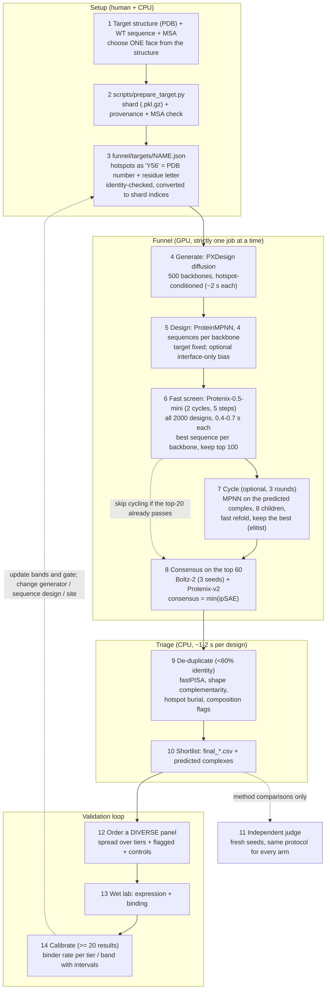
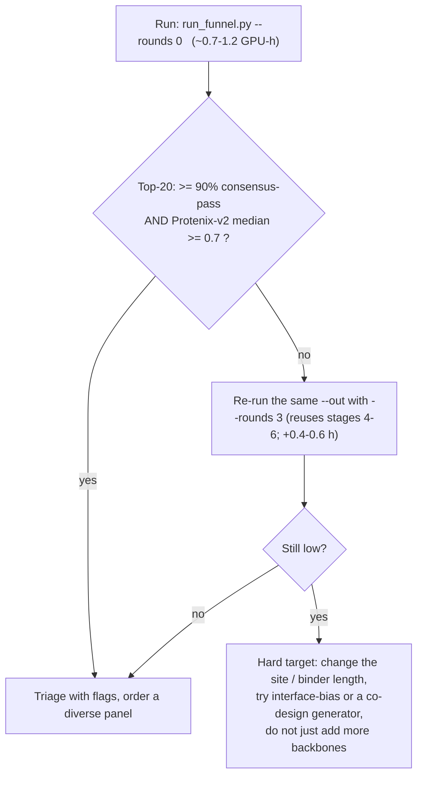

# How the software works: workflow graphs

A PNG of the main flow is in `docs/figures/workflow.png` (source: `docs/make_workflow_figure.py`). The Mermaid diagrams below render on GitHub and are the
editable versions. Times are one RTX 5090 for a 70–85-residue binder.

## 1. End-to-end flow

## 2. What each stage reads and writes

```mermaid
flowchart LR
    A["targets/NAME.json"] --> G["run_funnel.py<br/>stage_generate"]
    G -->|"gen/run/.../predictions/*.cif<br/>gen/converted.json (GLY-binder PDBs)"| D["stage_screen: MPNN"]
    D -->|"mpnn.csv"| F["Protenix fast<br/>(common.protenix_fold)"]
    F -->|"screen.csv (fast_ipsae, fast_iptm, cif path)<br/>screen_fast/pred/*"| Y["stage_cycle"]
    Y -->|"start_parents.csv, cycled_parents.csv<br/>cycle_children.csv, cycle/*"| Z["consensus()"]
    Z -->|"consensus_nocycle|cycled.csv<br/>consensus_*/boltz/seed*/**.cif, v2/pred/*"| Q["shortlist()"]
    Q -->|"final_nocycle|cycled.csv"| R["judge.py / compare.py<br/>add_pisa_to_runs.py"]
    G -. "timers.json (seconds per stage)" .-> R
```

## 3. Decision rules

Evidence for the rule: MDM2 (20/20 without cycling), PD-L1 (20/20), FimA (**16/20 without cycling, 20/20 with it**). See `docs/REPORT.md` §9 and `funnel/results/`.
